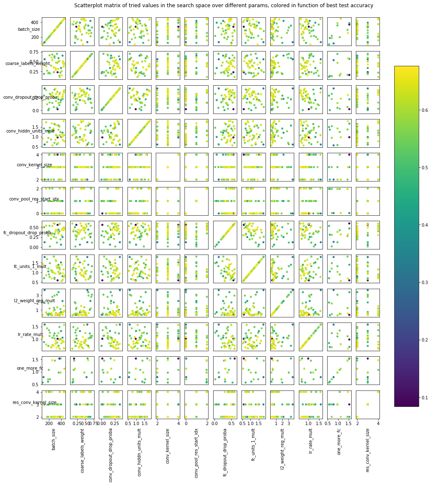
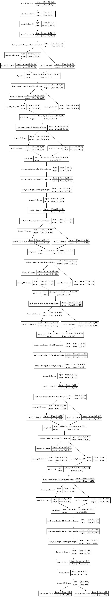
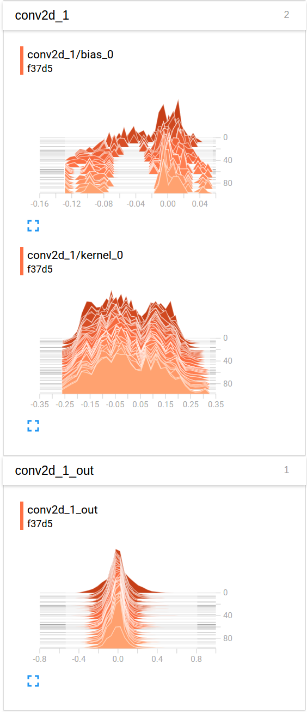
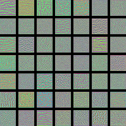

# Hyperopt for solving CIFAR-100 with a convolutional neural network (CNN) built with Keras and TensorFlow, GPU backend

This project acts as both a tutorial and a demo to using Hyperopt with Keras, TensorFlow and TensorBoard. Not only we try to find the best hyperparameters for the given hyperspace, but also we represent the neural network architecture as hyperparameters that can be tuned. This automates the process of searching for the best neural architecture configuration and hyperparameters.

Here, we are meta-optimizing a neural net and its architecture on the CIFAR-100 dataset (100 fine labels), a computer vision task. This code could be easily transferred to another vision dataset or even to another machine learning task.

## How Hyperopt works

First off, to learn how hyperopt works and what it is for, read the [hyperopt tutorial](https://github.com/Vooban/Hyperopt-Keras-CNN-CIFAR-100/blob/master/IntroductionToHyperopt.ipynb).


## Meta-optimize the neural network with Hyperopt

To run the hyperparameter search vy yourself, do: `python3 hyperopt_optimize.py`. You might want to look at `requirements.py` and install some of them manually to acquire GPU acceleration (e.g.: installing TensorFlow and Keras especially by yourself).

Optimization results will continuously be saved in the `results/` folder (sort files to take best result as human-readable text).
Also, the results are pickled to `results.pkl` to be able to resume the TPE meta-optimization process later simply by running the program again with `python3 hyperopt_optimize.py`.

If you want to learn more about Hyperopt, you'll probably want to watch that [video](https://www.youtube.com/watch?v=Mp1xnPfE4PY) made by the creator of Hyperopt. Also, if you want to run the model on the CIFAR-10 dataset, you must edit the file `neural_net.py`.

It is possible that you get better results than there are already here. Pull requests / contributions are welcome. Suggestion: trying many different initializers for the layers would be an interesting thing to try. Adding SELU activations would be interesting too. To restart the training with new or removed hyperparameters, it is recommended to delete existing results with `./delete_results.sh`.


## The Deep Convolutional Neural Network Model

Here is a basic overview of the model. I implemented it in such a way that Hyperopt will try to change the shape of the layers and remove or replace some of them according to some pre-parametrized ideas that I have got. Therefore, not only the learning rate is changed with hyperopt, but a lot more parameters.

```python

space = {
    # This loguniform scale will multiply the learning rate, so as to make
    # it vary exponentially, in a multiplicative fashion rather than in
    # a linear fashion, to handle his exponentialy varying nature:
    'lr_rate_mult': hp.loguniform('lr_rate_mult', -0.5, 0.5),
    # L2 weight decay:
    'l2_weight_reg_mult': hp.loguniform('l2_weight_reg_mult', -1.3, 1.3),
    # Batch size fed for each gradient update
    'batch_size': hp.quniform('batch_size', 100, 700, 5),
    # Choice of optimizer:
    'optimizer': hp.choice('optimizer', ['Adam', 'Nadam', 'RMSprop']),
    # Coarse labels importance for weights updates:
    'coarse_labels_weight': hp.uniform('coarse_labels_weight', 0.1, 0.7),
    # Uniform distribution in finding appropriate dropout values, conv layers
    'conv_dropout_drop_proba': hp.uniform('conv_dropout_proba', 0.0, 0.35),
    # Uniform distribution in finding appropriate dropout values, FC layers
    'fc_dropout_drop_proba': hp.uniform('fc_dropout_proba', 0.0, 0.6),
    # Use batch normalisation at more places?
    'use_BN': hp.choice('use_BN', [False, True]),

    # Use a first convolution which is special?
    'first_conv': hp.choice(
        'first_conv', [None, hp.choice('first_conv_size', [3, 4])]
    ),
    # Use residual connections? If so, how many more to stack?
    'residual': hp.choice(
        'residual', [None, hp.quniform(
            'residual_units', 1 - 0.499, 4 + 0.499, 1)]
    ),
    # Let's multiply the "default" number of hidden units:
    'conv_hiddn_units_mult': hp.loguniform('conv_hiddn_units_mult', -0.6, 0.6),
    # Number of conv+pool layers stacked:
    'nb_conv_pool_layers': hp.choice('nb_conv_pool_layers', [2, 3]),
    # Starting conv+pool layer for residual connections:
    'conv_pool_res_start_idx': hp.quniform('conv_pool_res_start_idx', 0, 2, 1),
    # The type of pooling used at each subsampling step:
    'pooling_type': hp.choice('pooling_type', [
        'max',  # Max pooling
        'avg',  # Average pooling
        'all_conv',  # All-convolutionnal: https://arxiv.org/pdf/1412.6806.pdf
        'inception'  # Inspired from: https://arxiv.org/pdf/1602.07261.pdf
    ]),
    # The kernel_size for convolutions:
    'conv_kernel_size': hp.quniform('conv_kernel_size', 2, 4, 1),
    # The kernel_size for residual convolutions:
    'res_conv_kernel_size': hp.quniform('res_conv_kernel_size', 2, 4, 1),

    # Amount of fully-connected units after convolution feature map
    'fc_units_1_mult': hp.loguniform('fc_units_1_mult', -0.6, 0.6),
    # Use one more FC layer at output
    'one_more_fc': hp.choice(
        'one_more_fc', [None, hp.loguniform('fc_units_2_mult', -0.6, 0.6)]
    ),
    # Activations that are used everywhere
    'activation': hp.choice('activation', ['relu', 'elu'])
}

# Here is one possible outcome for this stochastic space, let's plot that:
space_base_demo_to_plot = {
    'lr_rate_mult': 1.0,
    'l2_weight_reg_mult': 1.0,
    'batch_size': 300,
    'optimizer': 'Nadam',
    'coarse_labels_weight': 0.2,
    'conv_dropout_drop_proba': 0.175,
    'fc_dropout_drop_proba': 0.3,
    'use_BN': True,

    'first_conv': 4,
    'residual': 4,
    'conv_hiddn_units_mult': 1.0,
    'nb_conv_pool_layers': 3,
    'conv_pool_res_start_idx': 0.0,
    'pooling_type': 'inception',
    'conv_kernel_size': 3.0,
    'res_conv_kernel_size': 3.0,

    'fc_units_1_mult': 1.0,
    'one_more_fc': 1.0,
    'activation': 'elu'
}

```

<p align="center">
  
</p>

## Analysis of the hyperparameters

Here is an [analysis of the results regarding the effect of every hyperparameters](https://github.com/Vooban/Hyperopt-Keras-CNN-CIFAR-100/blob/master/AnalyzeHyperoptResults.ipynb). Here is an excerpt:

<p align="center">
  
</p>

This could help to redefine the hyperparameters and to narrow them down successively, relaunching the meta-optimization on refined spaces.


## Best result

The best model is this one: `results/model_0.676100010872_6066e.txt.json`.

The final accuracy is of 67.61% in average on the 100 fine labels, and is of 77.31% in average on the 20 coarse labels.
My results are comparable to the ones in the middle of [that list](http://rodrigob.github.io/are_we_there_yet/build/classification_datasets_results.html#43494641522d313030), under the CIFAR-100 section. The only image preprocessing that I do is a random flip left-right.

### Best hyperspace found:
```python

space_best_model = {
    "coarse_best_accuracy": 0.7731000242233277,
    "coarse_best_loss": 0.8012041954994201,
    "coarse_end_accuracy": 0.7565,
    "coarse_end_loss": 0.9019438380718231,
    "fine_best_accuracy": 0.6761000108718872,
    "fine_best_loss": 1.3936876878738402,
    "fine_end_accuracy": 0.6549,
    "fine_end_loss": 1.539645684337616,
    "history": {...},
    "loss": -0.6761000108718872,
    "model_name": "model_0.676100010872_6066e",
    "real_loss": 3.018656848526001,
    "space": {
        "activation": "elu",
        "batch_size": 320.0,
        "coarse_labels_weight": 0.3067103474295116,
        "conv_dropout_drop_proba": 0.25923531175521264,
        "conv_hiddn_units_mult": 1.5958302613876916,
        "conv_kernel_size": 3.0,
        "conv_pool_res_start_idx": 0.0,
        "fc_dropout_drop_proba": 0.4322253354921089,
        "fc_units_1_mult": 1.3083964454436132,
        "first_conv": 3,
        "l2_weight_reg_mult": 0.41206755600055983,
        "lr_rate_mult": 0.6549347353077412,
        "nb_conv_pool_layers": 3,
        "one_more_fc": null,
        "optimizer": "Nadam",
        "pooling_type": "avg",
        "res_conv_kernel_size": 2.0,
        "residual": 3.0,
        "use_BN": true
    },
    "status": "ok"
}
```

### Plotting this best hyperspace's model:

<p align="center">
  
</p>


## TensorBoard

TensorBoard can be used to inspect the best result (or all results in case you retrain and edit the code to enable TensorBoard on everything.)

It is possible to run `python3 retrain_best_with_tensorboard.py` to retrain the model and save TensorBoard logs, as well as saving the weights at their best state during training for a potential reuse. The instructions to run TensorBoard will be printed in the console at the end of the retraining.

Every training's TensorBoard log will be in a new folder under the "TensorBoard/" directory with an unique name (the model ID).

Here is the command to run TensorBoard once located in the root directory of the project:

```
tensorboard --logdir=TensorBoard/
```

Logs for the best model can be downloaded manually (approximately 7 GB). Refer to the text file under the folder [TensorBoard](https://github.com/Vooban/Hyperopt-Keras-CNN-CIFAR-100/tree/master/TensorBoard) for directions on how to download the logs from Google Drive before running the TensorBoard client with the `tensorboard --logdir=TensorBoard/` command. 

Just as an example, here is what can be seen in TensorBoard for the histograms related to the first convolutional layer, `conv2d_1`:

<p align="center">
  
</p>

It suggests that better weights and biases initialization schemes could be used.

It is also possible to see in TensorBoard more statistics and things, such as the distribution tab, the graphs tab, and the the scalars tab. See printscreens of all the statistics available under the [TensorBoard/previews/](https://github.com/Vooban/Hyperopt-Keras-CNN-CIFAR-100/tree/master/TensorBoard/previews) folder of this project.


## Visualizing what activates certain filters

We use the method of [gradient ascent in the input space](https://blog.keras.io/how-convolutional-neural-networks-see-the-world.html). This consists of generating images that activate certain filters in layers. This consists of using a loss on the filters' activation to then derive and apply gradients in the input space to gradually form input images that activate the given filters maximally. This is done for each filter separately.

To run the visualization, one must edit `conv_filters_visualization.py` to make it load the good weights (in case a retraining was done) and then run `python3 conv_filters_visualization.py`. The images for layers will be seen under the folder `layers/` of this project.

Here is an example for a low level layer, the one named `add_1`:

<p align="center">
  
</p>

## License

The MIT License (MIT)

Copyright (c) 2017 Vooban Inc.

For more information on sublicensing and the use of other parts of open-source code, see:
https://github.com/Vooban/Hyperopt-Keras-CNN-CIFAR-100/blob/master/LICENSE
